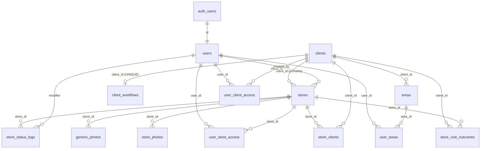

# Appoint — Supabase Database Schema

> **Fonte di verità** dello schema del database Supabase del progetto.
> Aggiornare questo file **ad ogni cambio di schema** (insieme alla migration corrispondente in [`./migrations/`](./migrations/)).
>
> _2026-07-27 (e) — **editing policy per cliente**: nuova colonna **`clients.editing_policy`** (`text not null default 'exclusive'`, CHECK `in ('exclusive','shared')`). `'shared'` per **AiCall** (id 5): qualsiasi agente autorizzato può riaprire un punto vendita già esitato e registrarne uno proprio; gli altri clienti restano `'exclusive'` (il primo agente mantiene il controllo). **Nessuna modifica alle RLS**: l'esclusività non è mai stata imposta dal DB, è una regola di interfaccia — vive tutta in `utils/editing-policy.ts → isLockedForMe`, usata sia dalla mappa sia dalla Dashboard. Nuova RPC **`get_store_for_manage(p_store_id)`** per aprire la scheda da fuori dalla mappa. Migration: [`migrations/20260727142706_clients_editing_policy.sql`](./migrations/20260727142706_clients_editing_policy.sql)._
>
> _2026-07-27 (d) — **ricerca punti vendita + colore pin**: nuova RPC **`search_stores_by_name(p_query, p_limit)`** (SECURITY DEFINER) per la barra di ricerca della mappa: la query diretta `from('stores').ilike(...)` faceva **Seq Scan** (706 ms, 132.737 buffer su ~14,6k store) perché la RLS inietta `user_can_see_store` per riga e l'indice trigram non veniva mai usato; inoltre non applicava `show_on_map` e restituiva `location` come WKB esadecimale, illeggibile per `parseCoords`. Ora: Bitmap Index Scan, 42 ms. Migration: [`migrations/20260727135354_search_stores_by_name.sql`](./migrations/20260727135354_search_stores_by_name.sql). Nuovo modulo condiviso **`utils/store-status.ts`** (`effectiveStoreStatus`, `STATUS_CARD_UI`): mappa e Dashboard partono dallo stesso status canonico, quindi il pin assume il colore del bucket dell'esito. Solo frontend, nessuna modifica di schema._
>
> _2026-07-27 (c) — **cliente escluso dalla mappa**: nuova colonna **`clients.show_on_map`** (`boolean`, not null, default `true`). Se `false`, `get_stores_within_radius` non restituisce i punti vendita del cliente → nessun pin su mappa e "Prospect vicini". Impostata a `false` per **Amex** (id 2, 2.079 store tutti nell'area di Milano). È una configurazione di **visualizzazione, non un permesso**: `user_can_see_store` / `user_can_see_client`, `user_client_access` e le RLS restano identiche, quindi storico, esiti ed export CSV supervisor sono intatti. Migration: [`migrations/20260727131525_clients_show_on_map.sql`](./migrations/20260727131525_clients_show_on_map.sql)._
>
> _2026-07-27 (b) — **scalabilità mappa**: `get_stores_within_radius` riscritta con filtro di visibilità **insiemistico** (lo scope del chiamante è risolto una volta per chiamata, non riga per riga con `user_can_see_store`) e promossa a **SECURITY DEFINER** per eliminare la doppia valutazione introdotta dalla RLS di `stores`. Firma argomenti e TABLE di ritorno **invariate**; nessuna regola di autorizzazione modificata (`user_can_see_store` / `user_can_see_client` restano intatte e continuano a reggere le RLS). Misure su produzione (~14,6k store): filtro AiCall 1.400 → 135 ms, Amex 1.390 → 110 ms, Scalapay 300 → 63 ms, default mappa 121 → 48 ms. Migration: [`migrations/20260727125237_gswr_set_based_visibility.sql`](./migrations/20260727125237_gswr_set_based_visibility.sql) (rollback in [`rollback/`](./rollback/))._
>
> _2026-07-14 — **diagnostica errori**: nuova tabella **`public.error_logs`** (message, stack, digest, source, url, user_id, user_email, user_agent, extra). Popolata lato client da `utils/error-logger.ts` (dai due error boundary `app/error.tsx`/`app/global-error.tsx` e dal listener globale `components/ErrorListener.tsx`). RLS: **INSERT aperto** (anche `anon`, gli errori possono capitare pre-login); **SELECT solo ai `supervisor`**. Migration: [`migrations/20260714120000_error_logs_table.sql`](./migrations/20260714120000_error_logs_table.sql)._
>
> _2026-07-02 (c) — **PROGETTO AICALL, lock del pin all'esito**: aggiunto `manage_form.submit.lock_pin = true` al workflow del cliente AiCall (`client_workflows`). Al salvataggio dell'esito il pin viene "preso in carico" → `stores.status = 'in_progress'` con log del modificatore, **senza** dialog di conferma e **senza** contare nel limite dei 10 pin. Effetto: il pin risulta **esitato** (icona in lavorazione), l'**autore** può riaprirlo e ri-esitare, gli **altri agenti** lo vedono **bloccato** ("trattativa in corso"). Solo frontend + dato workflow (nessuna modifica di schema); i 14 esiti già presenti sono stati backfillati a `in_progress` col rispettivo agente come modificatore._
>
> _2026-07-02 (b) — clienti **riservati**: nuova colonna **`clients.auto_grant_new_users`** (`boolean`, default `true`). Se `false`, il cliente NON viene concesso automaticamente ai nuovi utenti (`handle_new_user`) né a tutti gli utenti alla creazione (`grant_new_client_to_all_users`) — i grant restano manuali via `user_client_access`. Impostata a `false` per i clienti **maintenance** (id 3 "Maintenance Amex", id 4 "Lead da Maintenance"), ora visibili solo agli admin abilitati. Migration: [`migrations/20260702130000_clients_auto_grant_flag.sql`](./migrations/20260702130000_clients_auto_grant_flag.sql)._
>
> _2026-07-02 — nuova colonna **`stores.data_setup`** (`date`, nullable): la "Data Setup" con cui il partner (es. AiCall) ha generato il lead, distinta da `created_at`. Esposta anche dalla RPC **`get_stores_within_radius`** (aggiunta alla TABLE di ritorno → arriva al popup del pin e alla schermata "Gestisci") e mostrata negli export CSV e nella dashboard (agenti + supervisor). Migration: [`migrations/20260702120000_stores_data_setup.sql`](./migrations/20260702120000_stores_data_setup.sql). Backfill dei 367 lead AiCall esistenti dai valori del partner; +97 nuovi lead da importare via [`seed/20260616_aicall_leads.sql`](./seed/20260616_aicall_leads.sql) dopo la geocodifica (`node scripts/aicall/geocode.mjs && node scripts/aicall/gen-sql.mjs`)._
>
> _2026-06-26 — normalizzazione nomi utente (funzione `normalize_person_name`, backfill + `handle_new_user` deriva nome/cognome dall'email): rimuove i numeri finali e mette il punto sull'iniziale singola ([`migrations/20260626120000_normalize_user_names.sql`](./migrations/20260626120000_normalize_user_names.sql)). Nuovo indice composito `store_status_logs(modifier, created_at desc)` per lo storico dashboard ([`migrations/20260626120500_idx_store_status_logs_modifier_created_at.sql`](./migrations/20260626120500_idx_store_status_logs_modifier_created_at.sql))._
>
> _Ultimo aggiornamento: 2026-06-19 (c) — **sicurezza + performance RLS + onboarding** ([`migrations/20260619190000_security_perf_rls_and_auto_grant.sql`](./migrations/20260619190000_security_perf_rls_and_auto_grant.sql)): policy UPDATE su `stores` ristretta a `user_can_see_store` (era `USING (true)`); `store_status_logs` INSERT vincolato a `modifier = (select auth.uid())`; `search_path` fissato sulle funzioni; EXECUTE revocato ad `anon`; tutte le policy riscritte con `(select auth.uid())` (RLS init-plan); indici di copertura sulle FK. **Onboarding auto-grant**: i NUOVI utenti ricevono il grant di tutti i clienti; ogni NUOVO cliente (trigger `on_client_created`) viene concesso a tutti gli utenti → il caso "cliente aggiunto ma non visibile" non può più capitare._
>
> _2026-06-19 (b) — filtro mappa **multi-cliente**: `get_stores_within_radius` ora accetta anche `p_client_ids bigint[]` (in coda, default null) + nuova funzione **`get_clients_stores_bounds(p_client_ids bigint[])`** (bounds dell'insieme di clienti selezionati, per il fit-bounds multi-select). Migration: [`migrations/20260619170000_multi_client_filter_and_bounds.sql`](./migrations/20260619170000_multi_client_filter_and_bounds.sql)._
>
> _2026-06-19 (a) — performance mappa: indice spaziale **GIST su `stores.location`** + indice `store_status_logs (store_id, created_at desc)` + funzione **`get_client_stores_bounds(p_client_id)`** (conteggio + bounding box dei pin visibili per cliente, usata dal fit-bounds della mappa). Migration: [`migrations/20260619120000_map_perf_indexes_and_client_bounds.sql`](./migrations/20260619120000_map_perf_indexes_and_client_bounds.sql)._
>
> _2026-06-16 — nuovo cliente **PROGETTO AICALL** (lead generati dal partner AiCall) con workflow `manage_form` (tendina ESITO obbligatoria + campo NOTE) e import di 367 lead come `stores`. Seed: [`seed/20260616_aicall_project.sql`](./seed/20260616_aicall_project.sql) + [`seed/20260616_aicall_leads.sql`](./seed/20260616_aicall_leads.sql). Nessuna modifica di schema._
>
> _2026-05-14 — modello di visibilità per utente ([`20260514123300_user_visibility_scope`](./migrations/20260514123300_user_visibility_scope.sql)) + conversione di tutti gli utenti esistenti a `'restricted'` con snapshot dei grants ([`20260514135200_restrict_existing_users`](./migrations/20260514135200_restrict_existing_users.sql)) + relazione N:N stores↔clients e tracking del creatore degli store ([`20260514151900_store_multi_client_and_created_by`](./migrations/20260514151900_store_multi_client_and_created_by.sql))._

---

## Indice

- [Panoramica](#panoramica)
- [Estensioni Postgres](#estensioni-postgres)
- [Schema `public`](#schema-public)
  - [Tabelle](#tabelle)
    - [`clients`](#clients)
    - [`client_workflows`](#client_workflows)
    - [`users`](#users)
    - [`areas`](#areas)
    - [`user_areas`](#user_areas)
    - [`user_client_access`](#user_client_access)
    - [`user_store_access`](#user_store_access)
    - [`stores`](#stores)
    - [`store_clients`](#store_clients)
    - [`store_status_logs`](#store_status_logs)
    - [`store_visit_outcomes`](#store_visit_outcomes)
    - [`store_photos`](#store_photos)
    - [`generic_photos`](#generic_photos)
  - [Diagramma relazioni](#diagramma-relazioni)
  - [Modello di visibilità per utente](#modello-di-visibilit%C3%A0-per-utente)
  - [Funzioni custom](#funzioni-custom)
  - [Trigger](#trigger)
  - [RLS — Row Level Security](#rls--row-level-security)
- [Schema `storage` — Supabase Storage](#schema-storage--supabase-storage)
  - [Bucket](#bucket)
  - [Policy sugli oggetti](#policy-sugli-oggetti)
- [Schema `auth`](#schema-auth)
- [Convenzioni](#convenzioni)

---

## Panoramica

Il database supporta un'applicazione **field-sales / merchandising** che permette agli **agenti** di:

- esplorare una mappa di **negozi** (`stores`) filtrati per cliente/area geografica,
- aggiornarne lo **stato** di lavorazione tracciandone lo **storico** (`store_status_logs`),
- raccogliere **foto** sul campo (`store_photos`, `generic_photos`),
- registrare l'**esito di una visita** in base al workflow del cliente (`store_visit_outcomes`),
- essere assegnati ad **aree geografiche** (`areas` / `user_areas`).

Ruoli applicativi (`public.users.role`): `agent`, `am`, `supervisor`.
Il ruolo definisce solo la **gerarchia** (es. un AM vede solo gli agenti delle sue aree, via `user_areas`). La **visibilità sui dati di business** (clienti/negozi) è gestita separatamente dal campo `public.users.visibility_scope` e dalle tabelle `user_client_access` / `user_store_access` — vedi [Modello di visibilità per utente](#modello-di-visibilit%C3%A0-per-utente).

Stack: **PostgreSQL** + **PostGIS** (geolocalizzazione) + **Supabase Auth** + **Supabase Storage**.

---

## Estensioni Postgres

| Estensione           | Versione | Schema       | Note                                 |
| -------------------- | -------- | ------------ | ------------------------------------ |
| `plpgsql`            | 1.0      | `pg_catalog` | Linguaggio procedurale di default    |
| `pgcrypto`           | 1.3      | `extensions` | UUID e crittografia                  |
| `uuid-ossp`          | 1.1      | `extensions` | Generatori UUID                      |
| `pgjwt`              | 0.2.0    | `extensions` | JWT helper (usato da Supabase Auth)  |
| `pg_stat_statements` | 1.10     | `extensions` | Statistiche query                    |
| `pgsodium`           | 3.1.8    | `pgsodium`   | Crittografia simmetrica              |
| `supabase_vault`     | 0.3.1    | `vault`      | Vault per secret                     |
| `postgis`            | 3.3.7    | `public`     | **Geolocalizzazione store** (chiave) |
| `pg_trgm`            | 1.6      | `public`     | Ricerca fuzzy per nome punto vendita |

---

## Schema `public`

### Tabelle

#### `clients`

Anagrafica dei clienti business (es. brand committenti). Ogni `store` appartiene a un cliente.

| Colonna      | Tipo          | Null | Default                              | Note                       |
| ------------ | ------------- | ---- | ------------------------------------ | -------------------------- |
| `id`         | `smallint`    | NO   | `nextval('clients_id_seq')`          | **PK**                     |
| `name`       | `text`        | NO   | —                                    |                            |
| `created_at` | `timestamptz` | YES  | `now()`                              |                            |
| `logo`       | `text`        | YES  | —                                    | Path in bucket `client-logos` |
| `show_on_map` | `boolean` | NO | `true` | Se `false`, i punti vendita del cliente **non vengono disegnati sulla mappa**: `get_stores_within_radius` li esclude, e il cliente sparisce dalla tendina filtro della mappa e da quella di "Prospect vicini". Configurazione di **visualizzazione, non un permesso**: non incide su `user_can_see_store` / `user_can_see_client`, RLS, storico, esiti o export. `false` per **Amex** (id 2). Riattivare = `update clients set show_on_map = true where id = …` (nessun deploy). |
| `editing_policy` | `text` | NO | `'exclusive'` | CHECK `in ('exclusive','shared')`. `'exclusive'`: il primo agente che esita mantiene il controllo del punto vendita (per gli altri il pin risulta "trattativa in corso" e non espone "Gestisci"). `'shared'`: qualunque agente autorizzato può riaprirlo e registrare un proprio esito. **Regola di interfaccia, non di autorizzazione**: le RLS non cambiano. `'shared'` per **AiCall** (id 5). |
| `auto_grant_new_users` | `boolean` | NO | `true` | Se `false` il cliente è **riservato**: non concesso automaticamente ai nuovi utenti (`handle_new_user`) né a tutti alla creazione (`grant_new_client_to_all_users`); grant solo manuali via `user_client_access`. `false` per i clienti maintenance (id 3, 4). |

**RLS:** lettura `authenticated` vincolata a `public.user_can_see_client(auth.uid(), id)`.

---

#### `client_workflows`

Definisce il **workflow di visita** (in JSON) di ciascun cliente. _Un workflow per cliente_ (UNIQUE su `client_id`).

| Colonna      | Tipo          | Null | Default | Note                                                   |
| ------------ | ------------- | ---- | ------- | ------------------------------------------------------ |
| `id`         | `bigint`      | NO   | identity | **PK**                                                |
| `client_id`  | `smallint`    | NO   | —       | **FK** → `clients.id` (ON DELETE CASCADE), **UNIQUE** |
| `name`       | `text`        | NO   | —       |                                                        |
| `workflow`   | `jsonb`       | NO   | —       | Schema definito in `types.ts → ClientWorkflow`        |
| `active`     | `boolean`     | NO   | `true`  |                                                        |
| `created_at` | `timestamptz` | NO   | `now()` |                                                        |

**RLS:** lettura `authenticated` vincolata a `public.user_can_see_client(auth.uid(), client_id)` (un utente vede il workflow solo dei clienti che può vedere).

##### Campi del JSON `workflow`

Tutti i campi sono **opzionali** e indipendenti: si abilita solo quello che serve per cliente. La definizione TS canonica è in `types.ts → ClientWorkflow`.

| Campo                            | Tipo                              | Effetto sulla UI                                                                                                                                                  |
| -------------------------------- | --------------------------------- | ----------------------------------------------------------------------------------------------------------------------------------------------------------------- |
| `dom_link`                       | `string` (URL)                    | Aggiunge il bottone "Apri piattaforma DOM" sotto la foto check-in nel popup _legacy_.                                                                              |
| `failed_reasons`                 | `WorkflowReason[]`                | Sostituisce la select dei motivi quando lo status passa a `failed` (popup _legacy_).                                                                               |
| `non_existent_reasons`           | `WorkflowReason[]`                | Idem per lo status `non_existent` (popup _legacy_).                                                                                                                |
| `concluded_sub_workflow.sections`| `WorkflowSection[]`               | Mostrato sotto la select stato quando lo store passa a `concluded` (popup _legacy_, renderer `WorkflowRunner`).                                                    |
| `already_client_sub_workflow.sections` | `WorkflowSection[]`         | Idem per lo status `already_client`.                                                                                                                               |
| **`manage_form`**                | `DynamicManageForm` (vedi sotto)  | **Sostituisce completamente** la schermata "Gestisci" del popup con un form generato da JSON (sezioni, campi, foto, azioni). Quando assente → UI legacy invariata. |

##### `manage_form` — form dichiarativo della schermata Gestisci

Il JSON descrive `primary_actions` (bottoni in cima), una lista di `sections` con `fields`, e un `submit` finale. Tutti i campi `show_if` valutano una condizione sui valori già inseriti (mostra/nascondi field dinamicamente).

**Tipi di `field` supportati:**

| `type`           | Note                                                                                                |
| ---------------- | --------------------------------------------------------------------------------------------------- |
| `text`           | Input testo libero (single-line).                                                                   |
| `textarea`       | Input testo libero multi-line.                                                                      |
| `number`         | Input numerico (`min`, `max`, `step` opzionali).                                                    |
| `date`           | Input data nativo.                                                                                  |
| `select`         | Tendina single-choice (richiede `options: [{value,label}]`).                                        |
| `radio`          | Pulsanti a pillola single-choice.                                                                   |
| `multi_select`   | Pulsanti a pillola multi-choice. Valore = array di stringhe.                                        |
| `checkbox`       | Singolo toggle booleano.                                                                            |
| `photo`          | Carica foto su bucket Supabase (`bucket` opzionale, default `generic-photos`).                      |
| `external_link`  | Bottone-link verso URL (`url` obbligatorio).                                                        |
| `info`           | Banner di testo, no input (`variant: 'info' \| 'warning' \| 'success'`).                            |

**Tipi di `primary_actions`:** `directions` · `phone` · `email` · `external_link` (con `url`) · `status_change` (con `status`).

> ℹ️ Per il tipo **`phone`** il numero **non va scritto nel `label`**: il componente accoda da solo `stores.phone` all'etichetta del JSON (`"Chiama"` → `"Chiama 0635072117"`). Se il punto vendita non ha numero l'etichetta resta quella del JSON.

**Esempio minimale per un cliente nuovo:**

```json
{
  "manage_form": {
    "version": 1,
    "primary_actions": [
      { "id": "go", "type": "directions", "label": "Indicazioni", "icon": "navigation" },
      { "id": "call", "type": "phone",     "label": "Chiama",      "icon": "phone" }
    ],
    "sections": [
      {
        "id": "check_in",
        "title": "Presenza in negozio",
        "fields": [
          {
            "id": "check_in_photo",
            "type": "photo",
            "label": "Mi trovo qui",
            "bucket": "store-photos",
            "required": true
          }
        ]
      },
      {
        "id": "outcome",
        "title": "Esito visita",
        "fields": [
          {
            "id": "interest",
            "type": "radio",
            "label": "Interesse del titolare",
            "options": [
              { "value": "high",   "label": "Alto" },
              { "value": "medium", "label": "Medio" },
              { "value": "low",    "label": "Basso" }
            ]
          },
          {
            "id": "needs_callback",
            "type": "checkbox",
            "label": "Richiede ricontatto"
          },
          {
            "id": "notes",
            "type": "textarea",
            "label": "Note libere",
            "placeholder": "Eventuali dettagli..."
          }
        ]
      }
    ],
    "submit": {
      "label": "Salva esito",
      "sets_status": "concluded"
    }
  }
}
```

I valori vengono persistiti in `store_visit_outcomes.outcome_data` (jsonb) come `{ "field_id": value, ... }`. Se `submit.sets_status` è valorizzato, al click di "Salva" lo store passa anche a quello status (con il dialog di conferma del legacy).

##### Clienti configurati

| `id` | Nome                | Workflow                                                                                  |
| ---- | ------------------- | ----------------------------------------------------------------------------------------- |
| 1    | Scalapay            | _legacy_ (UI hardcoded)                                                                    |
| 2    | Amex                | `Amex Merchant Visit` (failed/non_existent reasons + sub-workflow concluded/already_client) |
| 3    | Maintenance Amex    | _(nessun workflow dedicato)_                                                               |
| 4    | Lead da Maintenance | `manage_form` minimale (`status_select`)                                                   |
| 5    | **AiCall** _(ex "PROGETTO AICALL")_ | `manage_form`: tendina **ESITO obbligatoria** (9 esiti OK/KO) + campo **NOTE** libero. Logo: riusa `2/logo.png` (stesso di Amex). |

**AiCall** _(creato come "PROGETTO AICALL", poi rinominato)_ — lead generati dal partner _AiCall_: i pin sono visibili a **tutti** gli agenti (grant su `user_client_access` per ogni utente). Lo Sheet "Gestisci" mostra un `select` obbligatorio `esito` con i valori:
`OK - In trattativa`, `KO - Non interessato`, `OK - Inviata ad Amex`, `KO - Lead non valido`, `KO - Irreperibile`, `KO - Già Cliente`, `OK - Richiamare`, `KO - Blocco DAP`, `OK - Appuntamento preso`; più un `textarea` `note`. Al salvataggio i valori finiscono in `store_visit_outcomes.outcome_data` (lo status del pin non viene cambiato). Vedi [`seed/20260616_aicall_project.sql`](./seed/20260616_aicall_project.sql).

> ℹ️ I **nuovi** utenti (signup successivo al seed) sono `restricted` senza grant: per far vedere loro PROGETTO AICALL va ri-eseguito lo step 3 del seed o concesso il grant in onboarding.

---

#### `users`

Profilo applicativo collegato a `auth.users` (1:1 sulla PK).
Popolato automaticamente da trigger `auth.on_auth_user_created → public.handle_new_user()`.

| Colonna            | Tipo          | Null | Default        | Note                                                                                  |
| ------------------ | ------------- | ---- | -------------- | ------------------------------------------------------------------------------------- |
| `id`               | `uuid`        | NO   | —              | **PK**, **FK** → `auth.users.id`                                                      |
| `created_at`       | `timestamptz` | NO   | `now()`        |                                                                                       |
| `name`             | `text`        | YES  | —              |                                                                                       |
| `surname`          | `text`        | YES  | —              |                                                                                       |
| `number`           | `text`        | YES  | —              | Numero di telefono                                                                    |
| `email`            | `text`        | YES  | —              |                                                                                       |
| `role`             | `text`        | NO   | `'agent'`      | CHECK IN (`'agent'`, `'am'`, `'supervisor'`)                                          |
| `visibility_scope` | `text`        | NO   | `'all'` *(¹)*  | CHECK IN (`'all'`, `'restricted'`). Vedi [Modello di visibilità per utente](#modello-di-visibilit%C3%A0-per-utente). |

*(¹)* Il default di **colonna** è `'all'` per non rompere gli utenti pre-esistenti, ma il trigger `handle_new_user()` inserisce i **nuovi** utenti con `'restricted'` (fail-closed).

**RLS:** lettura libera (`SELECT … USING (true)`).

---

#### `areas`

Aree geografiche (province) raggruppate per cliente, assegnabili agli utenti.

| Colonna      | Tipo          | Null | Default  | Note                          |
| ------------ | ------------- | ---- | -------- | ----------------------------- |
| `id`         | `bigint`      | NO   | identity | **PK**                        |
| `name`       | `text`        | NO   | —        |                               |
| `client_id`  | `smallint`    | YES  | —        | **FK** → `clients.id`         |
| `province`   | `text[]`      | YES  | —        | Es. `{"MI","BG","BS"}`        |
| `created_at` | `timestamptz` | NO   | `now()`  |                               |

**RLS:** lettura ad utenti `authenticated`.

---

#### `user_areas`

Tabella di join M:N **utente ↔ area**.

| Colonna   | Tipo     | Null | Note                                                |
| --------- | -------- | ---- | --------------------------------------------------- |
| `user_id` | `uuid`   | NO   | **PK** + **FK** → `public.users.id` (ON DELETE CASCADE) |
| `area_id` | `bigint` | NO   | **PK** + **FK** → `public.areas.id` (ON DELETE CASCADE) |

PK composta `(user_id, area_id)`.
**RLS:** lettura ad utenti `authenticated`.

> ℹ️ `user_areas` riguarda **solo la gerarchia AM ↔ agenti**, non la visibilità sui clienti/negozi. Per quella, vedi `user_client_access` / `user_store_access`.

---

#### `user_client_access`

Lista bianca **utente → cliente** per il modello di visibilità ([dettagli](#modello-di-visibilit%C3%A0-per-utente)).
Si applica solo se l'utente ha `users.visibility_scope = 'restricted'`. Per utenti `'all'` queste righe sono ignorate.

| Colonna      | Tipo          | Null | Note                                                       |
| ------------ | ------------- | ---- | ---------------------------------------------------------- |
| `user_id`    | `uuid`        | NO   | **PK** + **FK** → `public.users.id` (ON DELETE CASCADE)    |
| `client_id`  | `smallint`    | NO   | **PK** + **FK** → `public.clients.id` (ON DELETE CASCADE)  |
| `created_at` | `timestamptz` | NO   | `now()`                                                    |

PK composta `(user_id, client_id)`.
**RLS:** un utente legge solo le proprie righe (`user_id = auth.uid()`). Gestione concessioni via service role / SQL admin.

---

#### `user_store_access`

Lista bianca **utente → singolo negozio**. Complementare a `user_client_access` (la visibilità finale è l'**unione** delle due).

| Colonna      | Tipo          | Null | Note                                                       |
| ------------ | ------------- | ---- | ---------------------------------------------------------- |
| `user_id`    | `uuid`        | NO   | **PK** + **FK** → `public.users.id` (ON DELETE CASCADE)    |
| `store_id`   | `bigint`      | NO   | **PK** + **FK** → `public.stores.id` (ON DELETE CASCADE)   |
| `created_at` | `timestamptz` | NO   | `now()`                                                    |

PK composta `(user_id, store_id)`. Indice secondario `idx_user_store_access_store_id` su `(store_id)`.
**RLS:** un utente legge solo le proprie righe.

---

#### `stores`

Tabella **principale** dei negozi/POS sul territorio. Geocodificati tramite PostGIS.

| Colonna               | Tipo                  | Null | Default  | Note                                                                      |
| --------------------- | --------------------- | ---- | -------- | ------------------------------------------------------------------------- |
| `id`                  | `bigint`              | NO   | identity | **PK**                                                                    |
| `created_at`          | `timestamptz`         | NO   | `now()`  |                                                                           |
| `name`                | `text`                | YES  | —        | Ragione sociale / insegna                                                 |
| `address`             | `text`                | YES  | —        |                                                                           |
| `coordinates`         | `text`                | YES  | —        | Input formato `"[lat, lng]"` (parentesi quadre + spazio dopo la virgola, come le righe storiche) — sorgente per popolare `location` via trigger. ⚠️ Il trigger reale in produzione (`convert_coordinates_to_location`) toglie le parentesi e fa `split` con part1=lat, part2=lng → `ST_Point(lng, lat)`; **solo se** `location IS NULL`. (Nota: lo snapshot in [`schema/public_schema.sql`](./schema/public_schema.sql) riporta una versione semplificata/divergente di questa funzione.) |
| `location`            | `geography` (PostGIS) | YES  | —        | Punto geografico, calcolato dal trigger `trigger_convert_coordinates`     |
| `phone`               | `text`                | YES  | —        |                                                                           |
| `email`               | `text`                | YES  | —        |                                                                           |
| `owner_name`          | `text`                | YES  | —        |                                                                           |
| `category`            | `text`                | YES  | —        |                                                                           |
| `status`              | `text`                | YES  | `'free'` | `free`, `in_progress`, `concluded`, `already_client`, `failed`, `not_interested`, `non_existent` |
| `tier`                | `text`                | YES  | —        | `bronze`, `silver`, `gold`, `gold+`                                       |
| `consent`             | `boolean`             | YES  | —        | Consenso privacy                                                          |
| `type`                | `text`                | YES  | —        |                                                                           |
| `codice_ateco_gruppo` | `text`                | YES  | —        |                                                                           |
| `codice_ateco`        | `text`                | YES  | —        |                                                                           |
| `cap`                 | `text`                | YES  | —        | CAP                                                                       |
| `regione`             | `text`                | YES  | —        |                                                                           |
| `provincia`           | `text`                | YES  | —        |                                                                           |
| `comune`              | `text`                | YES  | —        |                                                                           |
| `pi`                  | `text`                | YES  | —        | Partita IVA                                                               |
| `cf_azienda`          | `text`                | YES  | —        | Codice fiscale azienda                                                    |
| `dipendenti`          | `text`                | YES  | —        |                                                                           |
| `fatturato`           | `text`                | YES  | —        | Fatturato annuo                                                           |
| `client_id`           | `smallint`            | NO   | `1`      | **FK** → `clients.id` (ON DELETE RESTRICT). **Cliente "primario"**: regge UI legacy (filtro mappa, workflow popup, `store_visit_outcomes`). Per la lista completa dei clienti associati allo store vedi [`store_clients`](#store_clients). |
| `created_by`          | `uuid`                | YES  | —        | **FK** → `public.users.id` (ON DELETE SET NULL). Utente applicativo che ha caricato il punto vendita via app. **NULL per le righe importate in bulk dal DB.** |
| `data_setup`          | `date`                | YES  | —        | "Data Setup" con cui il partner (es. AiCall) ha generato il lead. **Distinta da `created_at`** (istante di inserimento riga). Esposta dalla RPC `get_stores_within_radius` (→ popup/Gestisci) e mostrata in export CSV e dashboard. |

**Indici notabili:** `idx_stores_client_id` su `(client_id)`, `idx_stores_created_by` su `(created_by) WHERE created_by IS NOT NULL`, `idx_stores_location_gist` **GIST su `location`** (abilita Index Scan / KNN per `get_stores_within_radius`).

**RLS:**
- `SELECT` vincolato a `public.user_can_see_store(auth.uid(), id)` — vedi [Modello di visibilità per utente](#modello-di-visibilit%C3%A0-per-utente). Gli utenti `anon` non vedono nulla.
- `INSERT` consentito ad utenti `authenticated`.
- `UPDATE` consentito a tutti.

---

#### `store_clients`

Tabella di join **N:N** tra `stores` e `clients`. Permette ad un punto vendita di essere associato a più clienti contemporaneamente (es. lo stesso negozio è target sia per Amex che per Scalapay).

| Colonna      | Tipo          | Null | Default | Note                                                       |
| ------------ | ------------- | ---- | ------- | ---------------------------------------------------------- |
| `store_id`   | `bigint`      | NO   | —       | **PK** + **FK** → `stores.id` (ON DELETE CASCADE)          |
| `client_id`  | `smallint`    | NO   | —       | **PK** + **FK** → `clients.id` (ON DELETE CASCADE)         |
| `is_primary` | `boolean`     | NO   | `false` | Solo una riga `true` per `store_id` (indice unico parziale `uq_store_clients_primary_per_store`). Coincide con `stores.client_id`. |
| `created_at` | `timestamptz` | NO   | `now()` |                                                            |
| `created_by` | `uuid`        | YES  | —       | **FK** → `public.users.id` (ON DELETE SET NULL). NULL per le associazioni create dal backfill. |

PK composta `(store_id, client_id)`. Indici secondari `idx_store_clients_store_id` e `idx_store_clients_client_id` per i due versi di lookup.

**Semantica**
- `stores.client_id` resta il **cliente primario** (single FK, regge l'UI legacy: filtro mappa, workflow del popup, `store_visit_outcomes`).
- `store_clients` contiene **tutti** i clienti associati allo store, **incluso il primario** (la riga con `is_primary = true` mirrora `stores.client_id`).
- Per ogni store creato via app (form "Nuovo Punto Vendita") vengono inserite N righe, una per ogni cliente selezionato.
- Per gli store storici / importati in bulk, una migration di backfill ha popolato `store_clients` con una sola riga (`is_primary = true`) presa da `stores.client_id`.

**RLS:** `SELECT` / `INSERT` / `DELETE` ad utenti `authenticated`, condizionati a `public.user_can_see_store(auth.uid(), store_id)` (cioè: per agire su un'associazione devi poter vedere lo store).

> ℹ️ Le funzioni `public.user_can_see_store` / `public.user_can_see_client` / `public.get_stores_within_radius` considerano ANCHE le associazioni in `store_clients` (UNION con il legacy `stores.client_id`): un utente con grant su Amex vede lo store anche se il suo cliente primario è Scalapay, purché esista una riga `(store_id, amex_id)` in `store_clients`.

---

#### `store_status_logs`

Storico delle transizioni di `stores.status`. Inserimento manuale lato app (nessun trigger automatico).

| Colonna      | Tipo          | Null | Note                                                  |
| ------------ | ------------- | ---- | ----------------------------------------------------- |
| `id`         | `bigint`      | NO   | **PK**, identity                                      |
| `created_at` | `timestamptz` | NO   | `now()`                                               |
| `store_id`   | `bigint`      | NO   | **FK** → `stores.id`                                  |
| `prev`       | `text`        | NO   | Stato precedente                                      |
| `new`        | `text`        | NO   | Stato nuovo                                           |
| `modifier`   | `uuid`        | NO   | **FK** → `public.users.id` (autore della transizione) |
| `notes`      | `text`        | YES  |                                                       |

**Indici notabili:** `idx_store_status_logs_store_created` su `(store_id, created_at desc)` — la mappa carica i log degli store visibili in batch (`.in('store_id', …)`).

**RLS:**
- `SELECT` aperto.
- `INSERT` consentito agli utenti `authenticated`.

---

#### `store_visit_outcomes`

Risultato di una visita al negozio per uno specifico cliente, in base al workflow.
Esiste **al massimo un esito per coppia `(store_id, user_id)`** (UNIQUE `uq_store_visit_outcomes_store_user`).

| Colonna        | Tipo          | Null | Default | Note                                                |
| -------------- | ------------- | ---- | ------- | --------------------------------------------------- |
| `id`           | `bigint`      | NO   | identity | **PK**                                              |
| `store_id`     | `bigint`      | NO   | —       | **FK** → `stores.id` (ON DELETE CASCADE)            |
| `client_id`    | `smallint`    | NO   | —       | **FK** → `clients.id`                               |
| `user_id`      | `uuid`        | NO   | —       | (autore della visita)                               |
| `outcome_data` | `jsonb`       | NO   | `'{}'`  | Risposte alle sezioni del `client_workflows.workflow` |
| `created_at`   | `timestamptz` | NO   | `now()` |                                                     |

**RLS:** `SELECT` e `INSERT` autenticati; `UPDATE` solo del proprio record (`user_id = auth.uid()`).

---

#### `store_photos`

Foto associate a un negozio specifico.

| Colonna      | Tipo          | Null | Default  | Note                                          |
| ------------ | ------------- | ---- | -------- | --------------------------------------------- |
| `id`         | `bigint`      | NO   | sequence | **PK**                                        |
| `store_id`   | `int`         | NO   | —        | **FK** → `stores.id` (ON DELETE CASCADE)      |
| `user_id`    | `uuid`        | NO   | —        | Autore                                        |
| `photo_url`  | `text`        | NO   | —        | URL nel bucket `store-photos`                 |
| `created_at` | `timestamptz` | YES  | `now()`  |                                               |
| `updated_at` | `timestamptz` | YES  | `now()`  | Aggiornato dal trigger `update_…_updated_at`  |

**RLS:** lettura aperta agli `authenticated`; insert/delete del proprio (`auth.uid() = user_id`).

---

#### `generic_photos`

Foto generiche (es. dei materiali del POS) associate a un negozio. Stessa struttura di `store_photos`.

| Colonna      | Tipo          | Null | Default  | Note                                          |
| ------------ | ------------- | ---- | -------- | --------------------------------------------- |
| `id`         | `bigint`      | NO   | sequence | **PK**                                        |
| `store_id`   | `int`         | NO   | —        | **FK** → `stores.id` (ON DELETE CASCADE)      |
| `user_id`    | `uuid`        | NO   | —        |                                               |
| `photo_url`  | `text`        | NO   | —        | URL nel bucket `generic-photos`               |
| `created_at` | `timestamptz` | YES  | `now()`  |                                               |
| `updated_at` | `timestamptz` | YES  | `now()`  | Trigger `update_generic_photos_updated_at`    |

**RLS:** identica a `store_photos`.

---

### Diagramma relazioni



---

### Modello di visibilità per utente

Indipendente da `areas` / `user_areas` (che riguardano la gerarchia AM ↔ agenti), questo meccanismo regola **quali clienti e quali negozi un utente vede** sulla mappa e nei dropdown dell'app.

**Componenti**

| Cosa                            | Dove                              |
| ------------------------------- | --------------------------------- |
| Modalità di scope per utente    | `public.users.visibility_scope`   |
| Concessioni a livello cliente   | `public.user_client_access`       |
| Concessioni a livello negozio   | `public.user_store_access`        |
| Logica di scoping (predicate)   | `public.user_can_see_store(...)`, `public.user_can_see_client(...)` |

**Semantica**

| `visibility_scope` | `user_client_access` | `user_store_access` | Cosa vede l'utente                                                       |
| ------------------ | -------------------- | ------------------- | ------------------------------------------------------------------------- |
| `'all'`            | _(ignorato)_         | _(ignorato)_        | Tutti i clienti e tutti i negozi (comportamento storico).                 |
| `'restricted'`     | vuoto                | vuoto               | **Nessuno** (fail-closed).                                                |
| `'restricted'`     | `{A, B}`             | vuoto               | Tutti i negozi di A + tutti i negozi di B.                                |
| `'restricted'`     | vuoto                | `{s1, s2, s3}`      | Solo `s1`, `s2`, `s3` (anche di clienti diversi).                         |
| `'restricted'`     | `{A}`                | `{s7, s8}` (cli. C) | Tutti i negozi di A **+** `s7`, `s8` del cliente C.                       |

**Regole importanti**

- **Stato attuale**: TUTTI gli utenti (esistenti e nuovi) sono `'restricted'`. Gli utenti esistenti hanno ricevuto un grant "snapshot" su ogni cliente già presente al momento della migration `20260514135200_restrict_existing_users` — quindi continuano a vedere quello che vedevano prima.
- **Nuovi utenti**: il trigger `handle_new_user()` li crea con `'restricted'` **senza grant** → di default non vedono nulla finché un admin non concede esplicitamente clienti/negozi.
- **Nuovi clienti**: i clienti creati dopo la migration **non sono concessi automaticamente a nessuno** — vanno concessi esplicitamente agli utenti che devono vederli (è il pattern che abilita scenari come "cliente di test visibile solo a X").
- **Nessun ruolo bypassa lo scoping**: anche un `supervisor` con `'restricted'` vede solo ciò che è in elenco. Per dargli accesso totale → impostare `visibility_scope = 'all'`.
- **`user_can_see_client`** considera "visibile" anche il cliente di un negozio in `user_store_access` (per coerenza UI: se vedi un pin, devi vedere il nome/logo del suo cliente).
- **Punti di applicazione**:
  - RLS `SELECT` su `public.clients`, `public.stores`, `public.client_workflows`;
  - filtro esplicito dentro `public.get_stores_within_radius()` (che alimenta la mappa).

**Esempi pratici (gestione concessioni)**

```sql
-- Far diventare un utente "scoped"
update public.users
set visibility_scope = 'restricted'
where id = '<uuid>';

-- Concedergli tutti i negozi di un cliente
insert into public.user_client_access (user_id, client_id)
values ('<uuid>', 2)
on conflict do nothing;

-- Concedergli singoli negozi (oltre/invece che per cliente)
insert into public.user_store_access (user_id, store_id)
select '<uuid>', s.id
from public.stores s
where s.id in (101, 102, 103)
on conflict do nothing;

-- Rimettere un utente a "tutto"
update public.users
set visibility_scope = 'all'
where id = '<uuid>';
```

> ⚠️ Le tabelle dipendenti (`store_status_logs`, `store_visit_outcomes`, `store_photos`, `generic_photos`) **non** hanno una RLS che verifica direttamente lo scope. Sono accessibili agli `authenticated`, ma in pratica vengono filtrate "a monte" perché l'app parte sempre dalla lista degli stores visibili. Da rivedere se in futuro si esponessero endpoint che bypassano questa logica.

---

### Funzioni custom

> Esclusi i centinaia di simboli installati da PostGIS.

| Funzione                              | Argomenti                                                                       | Ritorno  | Note                                                                                                                                                       |
| ------------------------------------- | ------------------------------------------------------------------------------- | -------- | ---------------------------------------------------------------------------------------------------------------------------------------------------------- |
| `handle_new_user()`                   | —                                                                               | trigger  | **SECURITY DEFINER** (`search_path=public`, EXECUTE revocato a tutti — solo trigger). Inserisce la riga in `public.users` (`visibility_scope = 'restricted'`) quando viene creato un utente in `auth.users`, **e gli concede il grant dei clienti con `auto_grant_new_users = true`** (`user_client_access`) — i clienti riservati (es. maintenance) restano esclusi. |
| `grant_new_client_to_all_users()`     | —                                                                               | trigger  | **SECURITY DEFINER** (`search_path=public`, EXECUTE revocato a tutti — solo trigger). Su INSERT in `clients` (trigger `on_client_created`) concede il nuovo cliente a TUTTI gli utenti esistenti **solo se `new.auto_grant_new_users = true`** (i clienti riservati non vengono auto-concessi). Evita che un cliente non-riservato appena aggiunto risulti invisibile. |
| `convert_coordinates_to_location()`   | —                                                                               | trigger  | Trasforma il campo testuale `stores.coordinates` (`"lng,lat"`) nel punto PostGIS `stores.location`.                                                        |
| `user_can_see_store(p_user_id uuid, p_store_id bigint)`     | `uuid, bigint`                                              | `boolean` | **SECURITY DEFINER / STABLE**. Predicato di visibilità sul negozio. Considera `user_store_access`, `user_client_access` ↔ `stores.client_id` **e** `user_client_access` ↔ `store_clients.client_id`. Usato dalla RLS di `stores` / `store_clients` e dalla RPC `get_stores_within_radius`. |
| `user_can_see_client(p_user_id uuid, p_client_id smallint)` | `uuid, smallint`                                            | `boolean` | **SECURITY DEFINER / STABLE**. Predicato di visibilità sul cliente. Considera `user_client_access` **e** la presenza del cliente tra le associazioni (`stores.client_id` o `store_clients`) di uno store visibile via `user_store_access`. Usato dalla RLS di `clients` e `client_workflows`. |
| `get_stores_within_radius(...)`       | `lat double precision, lng double precision, radius double precision, p_client_id bigint, p_limit integer, p_client_ids bigint[]` | TABLE    | **SECURITY DEFINER / STABLE** (dal 2026-07-27). Ritorna negozi entro un raggio (in metri) da un punto, filtrati per cliente **e** per scope di visibilità del chiamante (`auth.uid()`). Filtro cliente: `p_client_ids` (array, multi-select; ha precedenza) **oppure** `p_client_id` (singolo, legacy); match su `stores.client_id` **o** `store_clients.client_id`. La TABLE di ritorno include `data_setup` e `pi` (dal 2026-07-02), così arrivano al popup del pin e alla schermata "Gestisci". Il filtro di visibilità è **insiemistico** — equivalente a `user_can_see_store` ma risolto una volta per chiamata; vedi il [Changelog 2026-07-27 (b)](#2026-07-27-b--scalabilit%C3%A0-di-get_stores_within_radius). EXECUTE: solo `authenticated` e `service_role`. |
| `get_store_for_manage(p_store_id bigint)` | `bigint` | TABLE (come `get_stores_within_radius` + `editing_policy`) | **SECURITY DEFINER / STABLE**. Carica UN punto vendita per aprire la scheda "Gestisci" fuori dalla mappa (Dashboard). Ritorna `ST_AsText(location)`, non il WKB grezzo. Applica il predicato di visibilità ma **non** `show_on_map`: dallo storico si deve poter riaprire anche una lead di un cliente non mappato. Espone `clients.editing_policy` del cliente primario. |
| `search_stores_by_name(p_query text, p_limit integer)` | `text, integer` | TABLE (`id, name, address, comune, provincia, location`) | **SECURITY DEFINER / STABLE**. Ricerca punti vendita per ragione sociale, per la barra di ricerca della mappa. Stesso predicato di visibilità insiemistico di `get_stores_within_radius` + filtro `clients.show_on_map`. Minimo 2 caratteri, cap risultati a 20, wildcard LIKE neutralizzati lato server. Ritorna `ST_AsText(location)` (`POINT(lng lat)`), non il WKB grezzo. Ranking: prefisso, poi nome più corto, poi alfabetico. |
| `get_client_stores_bounds(p_client_id bigint)` | `bigint`                                                              | TABLE (`n, min_lat, min_lng, max_lat, max_lng`) | **SECURITY DEFINER / STABLE**. Conteggio + bounding box dei pin **visibili al chiamante** per UN cliente (filtrato da `user_can_see_store`). _Variante singola; la mappa usa la versione array._ |
| `get_clients_stores_bounds(p_client_ids bigint[])` | `bigint[]`                                                        | TABLE (`n, min_lat, min_lng, max_lat, max_lng`) | **SECURITY DEFINER / STABLE**. Come sopra ma per un **INSIEME** di clienti (match su `stores.client_id` **o** `store_clients.client_id`). Usata dalla mappa per il fit-bounds automatico (dezoom) sulla selezione multi-cliente. |
| `getstoreswithinradius(...)`          | `lat, lng, radius`                                                              | TABLE    | _Legacy / deprecato_ — versione precedente di `get_stores_within_radius`.                                                                                  |
| `update_store_photos_updated_at()`    | —                                                                               | trigger  | Mantiene `store_photos.updated_at = now()` su UPDATE.                                                                                                      |
| `update_generic_photos_updated_at()`  | —                                                                               | trigger  | Mantiene `generic_photos.updated_at = now()` su UPDATE.                                                                                                    |

---

### Trigger

| Trigger                                | Tabella                  | Quando                   | Funzione                              |
| -------------------------------------- | ------------------------ | ------------------------ | ------------------------------------- |
| `on_auth_user_created`                 | `auth.users`             | AFTER INSERT             | `handle_new_user()`                   |
| `on_client_created`                    | `public.clients`         | AFTER INSERT             | `grant_new_client_to_all_users()`     |
| `trigger_convert_coordinates`          | `public.stores`          | BEFORE INSERT            | `convert_coordinates_to_location()`   |
| `trigger_convert_coordinates_update`   | `public.stores`          | BEFORE UPDATE            | `convert_coordinates_to_location()`   |
| `update_store_photos_updated_at`       | `public.store_photos`    | BEFORE UPDATE            | `update_store_photos_updated_at()`    |
| `update_generic_photos_updated_at`     | `public.generic_photos`  | BEFORE UPDATE            | `update_generic_photos_updated_at()`  |

---

### RLS — Row Level Security

| Tabella                | Policy                                          | Cmd      | Ruoli           | Condizione                                                            |
| ---------------------- | ----------------------------------------------- | -------- | --------------- | --------------------------------------------------------------------- |
| `clients`              | _Read clients via visibility scope_             | SELECT   | `authenticated` | `public.user_can_see_client(auth.uid(), id)`                          |
| `client_workflows`     | _Read client_workflows via visibility scope_    | SELECT   | `authenticated` | `public.user_can_see_client(auth.uid(), client_id)`                   |
| `users`                | _Enable read access for all users_              | SELECT   | `public`        | `true`                                                                |
| `areas`                | _Auth read areas_                               | SELECT   | `public`        | `auth.role() = 'authenticated'`                                       |
| `user_areas`           | _Auth read user_areas_                          | SELECT   | `public`        | `auth.role() = 'authenticated'`                                       |
| `user_client_access`   | _Users can read own client access_              | SELECT   | `authenticated` | `user_id = auth.uid()`                                                |
| `user_store_access`    | _Users can read own store access_               | SELECT   | `authenticated` | `user_id = auth.uid()`                                                |
| `stores`               | _Read stores via visibility scope_              | SELECT   | `public`        | `public.user_can_see_store(auth.uid(), id)`                           |
| `stores`               | _Enable insert for authenticated users only_    | INSERT   | `authenticated` | WITH CHECK `true`                                                     |
| `stores`               | _Enable update for users_                       | UPDATE   | `public`        | USING `true` / WITH CHECK `true`                                      |
| `store_clients`        | _Read store_clients via store visibility_       | SELECT   | `authenticated` | `public.user_can_see_store(auth.uid(), store_id)`                     |
| `store_clients`        | _Insert store_clients via store visibility_     | INSERT   | `authenticated` | WITH CHECK `public.user_can_see_store(auth.uid(), store_id)`          |
| `store_clients`        | _Delete store_clients via store visibility_     | DELETE   | `authenticated` | `public.user_can_see_store(auth.uid(), store_id)`                     |
| `store_status_logs`    | _Enable read access for all users_              | SELECT   | `public`        | `true`                                                                |
| `store_status_logs`    | _Enable insert for authenticated users only_    | INSERT   | `authenticated` | WITH CHECK `true`                                                     |
| `store_visit_outcomes` | _Authenticated read store_visit_outcomes_       | SELECT   | `public`        | `auth.role() = 'authenticated'`                                       |
| `store_visit_outcomes` | _Authenticated insert store_visit_outcomes_     | INSERT   | `public`        | WITH CHECK `auth.role() = 'authenticated'`                            |
| `store_visit_outcomes` | _Authenticated update own store_visit_outcomes_ | UPDATE   | `public`        | USING `user_id = auth.uid()`                                          |
| `store_photos`         | _Authenticated users can view all photos_       | SELECT   | `authenticated` | `true`                                                                |
| `store_photos`         | _Users can insert their own photos_             | INSERT   | `authenticated` | WITH CHECK `auth.uid() = user_id`                                     |
| `store_photos`         | _Users can delete their own photos_             | DELETE   | `authenticated` | `auth.uid() = user_id`                                                |
| `generic_photos`       | _Authenticated users can view all generic photos_ | SELECT | `authenticated` | `true`                                                                |
| `generic_photos`       | _Users can insert their own generic photos_     | INSERT   | `authenticated` | WITH CHECK `auth.uid() = user_id`                                     |
| `generic_photos`       | _Users can delete their own generic photos_     | DELETE   | `authenticated` | `auth.uid() = user_id`                                                |

> ⚠️ Diverse tabelle (`store_status_logs`, `users`, …) hanno ancora policy con `USING (true)` per il `SELECT`, cioè lettura completamente aperta. `stores`, `clients` e `client_workflows` sono invece vincolati dal [modello di visibilità per utente](#modello-di-visibilit%C3%A0-per-utente). Valutare in futuro un irrigidimento anche sulle tabelle dipendenti (`store_status_logs`, `store_visit_outcomes`, `store_photos`, `generic_photos`) per evitare leak di dati riferiti a negozi non visibili.

---

## Schema `storage` — Supabase Storage

### Bucket

| ID               | Public | Limite size | MIME consentiti                                       |
| ---------------- | ------ | ----------- | ----------------------------------------------------- |
| `client-logos`   | ✅ sì  | 1 MB        | `image/jpeg`, `image/png`, `image/webp`, `image/gif`  |
| `generic-photos` | ✅ sì  | 5 MB        | `image/jpeg`, `image/png`, `image/webp`, `image/gif`, `image/jpg` |
| `store-photos`   | ✅ sì  | —           | —                                                     |

### Policy sugli oggetti

> _Tutte le policy sotto sono in `storage.objects`._

**Bucket `client-logos`:**
- `SELECT` pubblico (chiunque, anche `anon`).
- `INSERT` / `UPDATE` / `DELETE` consentiti agli utenti `authenticated`.

**Bucket `store-photos`:**
- `SELECT` e `INSERT` consentiti agli `authenticated`.
- `UPDATE` / `DELETE` solo del proprio: `auth.uid()::text = (string_to_array(name, '_'))[2]`.
  > Convenzione **filename**: `<prefix>_<uid>_<...>.<ext>` — il segmento `[2]` deve corrispondere all'UID dell'utente.

**Bucket `generic-photos`:**
- Idem a `store-photos`, con la stessa convenzione di filename.

---

## Schema `auth`

Gestito interamente da **Supabase Auth** — non modificare manualmente.
La sola integrazione custom è il trigger `auth.on_auth_user_created` che popola `public.users`.

---

## Convenzioni

### Naming

- **Tabelle**: `snake_case`, plurale (`stores`, `clients`, `store_photos`).
- **Tabelle di join**: `entità1_entità2` (es. `user_areas`).
- **Colonne FK**: `<entità>_id` (`store_id`, `client_id`, `user_id`).
- **PK**: sempre `id`.
- **Timestamps**: `created_at`, `updated_at` (timestamptz, default `now()`).
- **Funzioni trigger**: `<azione>_<tabella>_<colonna?>` (es. `update_store_photos_updated_at`).
- **Indici**: `idx_<tabella>_<colonne>`.

### Migration

Vedi [`./migrations/README.md`](./migrations/README.md) per la convenzione di naming/numerazione delle migration.

---

## Changelog

### 2026-07-27 (e) — `clients.editing_policy`: lead condivisi per AiCall

**Requisito.** Per AiCall, dopo il primo esito qualsiasi agente autorizzato deve
poter riaprire il punto vendita e modificarne gli esiti. Per tutti gli altri
clienti il comportamento resta quello storico: il primo agente che esita mantiene
il controllo.

**Dove veniva presa la decisione (una sola volta, in un solo punto).**
`components/map.tsx`, dentro `fetchStoresAndLogs`:

```js
const otherLog = (logsByStore[store.id] ?? []).find((l) => l.modifier !== user.id);
…
modifiedByOtherUser: modifierId != null
```

e poi nel rendering del marker: se `modifiedByOtherUser` è vero, **`StorePopup`
non viene proprio renderizzato** — al suo posto un popup di sola lettura. Il lock
quindi **non è mai stato un permesso**: è l'assenza dell'interfaccia. Il database
non lo ha mai imposto (la policy UPDATE di `stores` è `user_can_see_store`, senza
alcun controllo di proprietà).

**Soluzione.** Nuova colonna `clients.editing_policy` (`'exclusive'` default |
`'shared'`), e un unico helper condiviso:

```ts
// utils/editing-policy.ts
export function isLockedForMe({ policy, modifierId, myId }) {
  if (policy === 'shared') return false;
  return modifierId != null && modifierId !== myId;
}
```

Nessun riferimento a un cliente specifico da nessuna parte del codice: per un
cliente nuovo basta impostare la colonna, senza deploy.

| Superficie | Come applica la regola |
| ---------- | ---------------------- |
| Mappa | `clients` era già in memoria → `clientPolicyRef`, **zero query aggiuntive**. Una riga: `modifiedByOtherUser: isLockedForMe(...)` |
| Dashboard | La scheda aperta dallo storico applica lo stesso helper; la policy arriva da `get_store_for_manage` |

`modifierId` continua a essere calcolato anche in `'shared'` → AM e supervisor
mantengono l'indicazione "gestito da X". Cambia solo se questo **blocca** o no.

**Nessuna modifica alle RLS.** `store_visit_outcomes` ha già UNIQUE
`(store_id, user_id)` e UPDATE limitato al proprio record: in `'shared'` l'agente
B **scrive la propria riga** senza sovrascrivere quella di A, e lo storico esiti
del pin resta completo. L'esito "corrente" del negozio è il più recente — che è
già come la Dashboard calcola i bucket. Se il form è aperto da un agente che non
ha ancora un proprio esito, viene **precompilato con l'ultimo esito di chiunque**
(`prefillOnly`), così si continua da dove si era arrivati; il bottone però non
parte nello stato "Salvato", perché quei valori non sono ancora suoi.

**Come è garantito che gli altri clienti non cambino.** Tre livelli: `default
'exclusive'` sulla colonna; CHECK sul dominio; e `isLockedForMe` che tratta
**qualsiasi** valore diverso da `'shared'` (incluso NULL, stringa vuota o un
valore futuro non ancora gestito) come `'exclusive'`. Verificato con 10 casi:

| policy | pin di | atteso | esito |
| ------ | ------ | ------ | ----- |
| `exclusive` | altro agente | bloccato | ✔ |
| `exclusive` | me / nessuno | libero | ✔ |
| assente / NULL / `''` / valore futuro | altro agente | bloccato (fail-safe) | ✔ |
| `shared` | altro agente / me / nessuno | libero | ✔ |

Stato in produzione: `editing_policy = 'shared'` **solo** per AiCall; Scalapay,
Amex, Maintenance Amex e Lead da Maintenance restano `'exclusive'`. Impatto: i
363 punti vendita AiCall con storico diventano lavorabili da qualsiasi agente del
progetto; i 204 di Scalapay e i 48 di Amex non cambiano.

### 2026-07-27 (d) — Ricerca punti vendita scalabile + colore pin coerente

**Ricerca (`search_stores_by_name`).** La barra di ricerca della mappa cercava già
sia indirizzi (Nominatim) sia punti vendita, ma la parte "negozi" aveva **tre**
difetti, tutti risolti dalla nuova RPC:

1. **Seq Scan.** `from('stores').ilike('name', …)` passa dalla RLS di `stores`, che
   inietta `user_can_see_store(auth.uid(), id)`. Il planner la valutava PRIMA del
   predicato sul nome → l'indice `stores_name_trgm_idx` non veniva **mai** usato:
   `Rows Removed by Filter: 14617`, **706 ms**, **132.737 buffer**, con costo
   lineare sul totale dei negozi. Con la RPC: `Bitmap Index Scan`, **42 ms**,
   **1.462 buffer**, costo proporzionale ai match.
2. **Nessun `show_on_map`.** Restituiva negozi (es. Amex) che sulla mappa non
   hanno alcun pin: si volava su un punto vuoto.
3. **Coordinate illeggibili.** `stores.location` letta dalla tabella arriva come
   WKB esadecimale (`0101000020E6…`), mentre `utils/navigation.ts → parseCoords`
   accetta solo `POINT(lng lat)`: ogni risultato veniva scartato da
   `.filter(Boolean)`. La RPC ritorna `ST_AsText`, come `get_stores_within_radius`.

Verificato: Amex escluso anche cercandone il nome esatto, wildcard `%`/`_`
neutralizzati lato server, taglio sotto i 2 caratteri, cap a 20 risultati,
`location` sempre in formato `POINT(...)`, fail-closed senza JWT.

**Colore dei pin (`utils/store-status.ts`).** Il pin sceglieva l'icona da
`store.status` grezzo. Per i clienti con `manage_form` + `lock_pin` (AiCall) quel
valore resta **`in_progress` per sempre** dal primo esito in poi: il ri-esito non
poteva cambiare colore al pin, mentre la Dashboard classificava lo stesso negozio
in tutt'altro bucket. Ora entrambe le superfici passano da
**`effectiveStoreStatus(rawStatus, esito)`** — un unico punto che fa vincere
l'esito sullo status grezzo, appoggiandosi alla mappatura già esistente
`ESITO_TO_STATUS`.

- La mappa carica gli esiti **in batch per i soli pin già a schermo**
  (`.in('store_id', …)`), stesso pattern della query dei log: scala col numero di
  pin visibili (≤ `CLIENT_LIMIT`), **non** col totale dei negozi.
- Al salvataggio di un esito, `onOutcomeSaved` aggiorna **solo** quel negozio in
  memoria → il pin si ricolora subito, **senza alcuna nuova fetch**.
- I colori delle card della Dashboard vivono ora in `STATUS_CARD_UI`, non più
  inline in `dashboard/page.tsx`.

Impatto misurato: **270 pin** cambiano colore, **tutti e soli** gli AiCall con
esito (103 → `not_interested`, 102 → `failed`, 37 → `non_existent`, 22 →
`concluded`, 6 → `already_client`). Nessun pin di Scalapay, Amex o altri clienti
è toccato.

> ⚠️ **Divergenza di palette lasciata invariata di proposito.** Le icone dei pin e
> i colori delle card non coincidono per tre stati: `already_client` (pin verde
> `#039855` / card blu), `not_interested` (pin rosso `#DE2E21` / card grigia),
> `non_existent` (pin grigio `#6b7280` / card arancione). Allinearle cambierebbe
> il colore di pin già in produzione, quindi non è stato fatto in questo giro.
> Ciò che `utils/store-status.ts` garantisce è che entrambe partano dallo
> **stesso status canonico**, non che usino gli stessi colori.

### 2026-07-27 (c) — `clients.show_on_map`: Amex fuori dalla mappa

**Requisito.** I 2.079 punti vendita **Amex** (id 2) — tutti nell'area di Milano:
2.005 in provincia MI + 74 in MB — non devono più comparire come pin. Tutti gli altri
clienti invariati; dashboard, estrazioni e storico non alterati.

**Dove è applicato il filtro.** Nuova colonna **`clients.show_on_map`**
(`boolean not null default true`), impostata a `false` per Amex. La esclusione avviene
in **un solo punto logico**, `get_stores_within_radius`, che alimenta sia i pin della
mappa sia "Prospect vicini" della dashboard:

```sql
and (
  s.client_id = any(v_map_clients)                       -- v_map_clients = clienti con show_on_map
  or exists (select 1 from public.store_clients sc
             where sc.store_id = s.id and sc.client_id = any(v_map_clients))
)
```

Semantica: uno store compare se ha **almeno un** cliente associato mappabile. Un
ipotetico store con primario Amex ma associato anche a Scalapay resterebbe quindi
visibile (è un target Scalapay legittimo) — verificato in transazione annullata.
Oggi il caso non esiste: 0 store multi-cliente, 0 store con Amex come secondario.

**Perché non revocare i grant `user_client_access`.** Sarebbe stata la scorciatoia
sbagliata: avrebbe tolto Amex dalla RLS di `clients` e `client_workflows`, facendo
sparire nome e logo dallo **storico** dei 48 store già lavorati e dai **68
`store_status_logs`**, rompendo l'export supervisor; e il trigger `handle_new_user`
(Amex ha `auto_grant_new_users = true`) lo avrebbe ri-concesso ad ogni nuovo utente.
`show_on_map` invece **non tocca l'autorizzazione**: Amex resta autorizzato, solo non
mappato.

**Frontend (nessun id hardcoded).**

| File | Modifica |
| ---- | -------- |
| `components/map.tsx` | tendina filtro clienti: `.eq('show_on_map', true)` |
| `components/map.tsx` | **potatura della selezione persistita**: `selectedClientIds` viene ripulito dagli id non più presenti in `clients`. Senza questo, un agente con Amex selezionato in `localStorage` (`appoint.mapFilters`) si sarebbe trovato un filtro attivo su un cliente **senza più la sua chip** → mappa vuota e nessun modo di deselezionarlo |
| `app/protected/dashboard/page.tsx` | tendina "Prospect vicini": `.eq('show_on_map', true)` |

**Non modificati di proposito.**

- **Export CSV "Esporta lista negozi"** (supervisor, `dashboard/page.tsx`): non passa
  dalla RPC → Amex resta estraibile.
- **`components/NewStoreForm.tsx`**: Amex resta selezionabile in creazione.
  `show_on_map` riguarda il rendering dei pin, non il ritiro del cliente.
- **`store_status_logs`, `store_visit_outcomes`, dashboard storico**: intatti.

**Verifiche eseguite.**

- Diff before/after su 77 utenti × 8 scenari: il delta è **esattamente** i 2.079 store
  Amex. Filtro Scalapay 11.438 → 11.438, filtro AiCall 1.081 → 1.081, filtro cliente
  riservato invariato, filtro Amex 2.079 → **0**.
- Per entrambi i profili di visibilità: **0 store comparsi**, e ogni store rimosso ha
  Amex come unico cliente associato (nessun non-Amex toccato).
- Dati Amex ancora presenti e leggibili dopo la modifica: 2.079 store in tabella,
  48 lavorati, 68 log, `clients.name = 'Amex'` risolvibile via RLS.
- `tsc --noEmit` e `next build` verdi.

**Rollback:** `update public.clients set show_on_map = true where id = 2;` — una riga,
effetto immediato, nessun DDL. Ripristino completo (anche del filtro nella RPC) in
`rollback/20260727131525_clients_show_on_map_rollback.sql`.

**Nota di coerenza.** `get_client_stores_bounds` / `get_clients_stores_bounds` **non**
applicano `show_on_map`. Oggi non le chiama più nessuno (la mappa calcola i bounds lato
client dai pin già caricati), ma se venissero riattivate includerebbero Amex nel
fit-bounds. Da allineare in quel caso.

**Impatto sulle performance.** Il default mappa su Milano passa da 48 a 78 ms: Milano è
esattamente dove stanno i pin Amex, quindi la KNN deve scartarne 2.079 prima di
riempire il limite di 250 (resta comunque sotto i 121 ms di partenza). Il caso con
filtro cliente migliora leggermente (135 → 122 ms). Vedi il "residuo noto" del
changelog (b): togliendo l'indice ridondante `idx_store_clients_store_id` questo
scenario scende a 61 ms (misurato in transazione annullata).

### 2026-07-27 (b) — Scalabilità di `get_stores_within_radius`

**Problema misurato** (produzione, ~14,6k store, utente `restricted` con grant `{1,2,5}`).
Il predicato di visibilità era la funzione plpgsql `user_can_see_store(auth.uid(), s.id)`
valutata **riga per riga**, quindi con costo `O(N_store_totali)` invece di
`O(N_store_visibili)`. Il piano mostrava `Rows Removed by Filter: 14395`, cioè
l'intero indice GIST percorso per ogni chiamata. Tre difetti sovrapposti:

1. **Doppia valutazione.** La funzione era `SECURITY INVOKER`, quindi la policy RLS
   `Read stores via visibility scope` ri-applicava `user_can_see_store` **oltre** al
   filtro esplicito già presente nel corpo → due chiamate plpgsql per riga:
   ```
   Filter: (user_can_see_store($0, id) AND user_can_see_store(…jwt…, id) AND …)
   ```
2. **`clients` in Seq Scan dentro Nested Loop**, una volta per pin: anche `clients` è
   RLS-filtrata (`user_can_see_client`) e la tabella **non era mai stata analizzata**
   (`reltuples = -1`) → il planner stimava 263 righe su 5.
3. Predicato plpgsql non inlineabile → nessuna spinta verso l'indice.

**Intervento.** Lo scope del chiamante viene risolto **una volta per chiamata**
(`visibility_scope`, array dei `user_client_access`, presenza di `user_store_access`,
array dei clienti visibili per il join nome/logo); il predicato per riga diventa un test
di appartenenza ad array + lookup su PK. La funzione passa a **SECURITY DEFINER** per
togliere la doppia valutazione, con `search_path` fissato, fail-closed su
`auth.uid() is null` e su utente assente da `public.users`, ed EXECUTE revocato a
`public`/`anon`. Aggiunto `analyze` su `clients` / `stores`.

**Cosa NON cambia.** Firma argomenti, default dei parametri e TABLE di ritorno sono
**identici** (nessun impatto sulla schema cache di PostgREST, `components/map.tsx` e
`app/protected/dashboard/page.tsx` non toccati). `user_can_see_store` e
`user_can_see_client` non sono state modificate e restano il predicato delle RLS.
Il LEFT JOIN su `clients` continua a restituire `client_name`/`client_logo` **NULL**
quando il cliente primario non è visibile al chiamante (comportamento riprodotto
esplicitamente, dato che SECURITY DEFINER disattiva la RLS nel corpo).

**Verifiche eseguite prima del commit.**

- Parità **esaustiva** su tutti i 14.608 store geolocalizzati, per entrambi i profili di
  visibilità presenti in produzione (`restricted {1,2,5}` → 74 utenti;
  `restricted {1,2,3,4,5}` → 3 utenti): l'insieme di id restituito dalla RPC coincide
  **esattamente** con `user_can_see_store`.
- Matrice 77 utenti × 8 scenari (nessun filtro, singolo cliente, multi-cliente,
  cliente riservato, default mappa): i fingerprint si raggruppano **esattamente** sui
  due profili di grant → nessun utente devia.
- Fail-closed verificato: chiamata senza JWT e con `sub` inesistente → 0 righe.
- Ramo `user_store_access` (0 righe in produzione, quindi non coperto dai dati reali)
  testato dentro una transazione annullata: grant su singolo store di un cliente non
  concesso → lo store compare, sia senza filtro sia filtrando su quel cliente.
- `client_name`/`client_logo` coerenti con `user_can_see_client` su tutti gli store.
- `tsc --noEmit` e `next build` verdi.

**Risultato.**

| Scenario (raggio Italia, `p_limit` 2000) | Prima | Dopo | Δ |
| ---------------------------------------- | ----- | ---- | - |
| `p_client_id = 5` (AiCall)               | 1.400 ms | 135 ms | −90% |
| `p_client_id = 2` (Amex)                 | 1.390 ms | 110 ms | −92% |
| `p_client_id = 1` (Scalapay)             |   300 ms |  63 ms | −79% |
| default mappa (2 km / 250 pin)           |   121 ms |  48 ms | −60% |

Caricamento mappa completo (la mappa lancia una RPC per cliente selezionato in
parallelo, `{1,2,5}`): da ~3,1 s a ~0,3 s di lavoro DB.

**Rollback:** `rollback/20260727125237_gswr_set_based_visibility_rollback.sql`
(ripristina il corpo precedente; nessun dato né schema toccati).

**Residuo noto.** Con filtro cliente attivo la `ORDER BY … <->` percorre comunque tutto
l'indice GIST (`Rows Removed by Filter: 13527`) e il 71% dei buffer restanti viene dalla
sotto-query correlata `exists(store_clients)` del filtro cliente, che usa
`idx_store_clients_store_id` (solo `store_id`) e deve poi leggere l'heap per `client_id`.
`store_clients_pkey (store_id, client_id)` renderebbe l'accesso index-only e rende
`idx_store_clients_store_id` ridondante. Non affrontato in questa migration.

### 2026-07-27 — Ricerca per nome punto vendita

- Estensione `pg_trgm` + indice GIN `stores_name_trgm_idx` su `stores.name`
  (migration `20260727120000_stores_name_trgm_index.sql`).
- Serve alla barra di ricerca della mappa, che ora cerca sia gli indirizzi
  (Nominatim) sia i punti vendita per ragione sociale (`stores.name ilike`,
  lato server con `limit` basso, mai client-side sull'intero dataset).
- Modifica **additiva**: nessuna colonna/tabella toccata, RLS invariata.
  Verificato: `Bitmap Index Scan` su `stores_name_trgm_idx`, ~0.3 ms su ~14.5k
  negozi (prima: `Seq Scan`).
