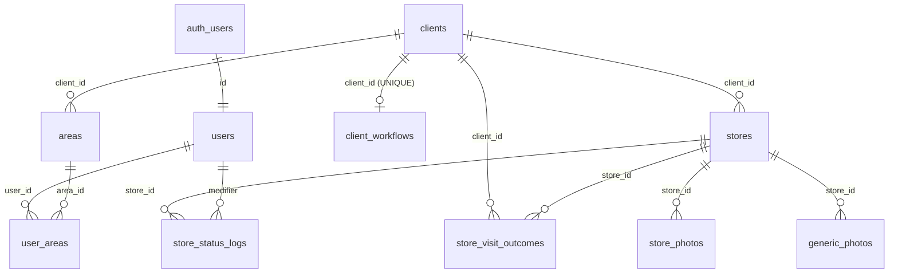

# Appoint — Supabase Database Schema

> **Fonte di verità** dello schema del database Supabase del progetto.
> Aggiornare questo file **ad ogni cambio di schema** (insieme alla migration corrispondente in [`./migrations/`](./migrations/)).
>
> _Ultimo aggiornamento: 2026-05-14 — baseline iniziale._

---

## Indice

- [Panoramica](#panoramica)
- [Estensioni Postgres](#estensioni-postgres)
- [Schema `public`](#schema-public)
  - [Tabelle](#tabelle)
    - [`clients`](#clients)
    - [`client_workflows`](#client_workflows)
    - [`users`](#users)
    - [`areas`](#areas)
    - [`user_areas`](#user_areas)
    - [`stores`](#stores)
    - [`store_status_logs`](#store_status_logs)
    - [`store_visit_outcomes`](#store_visit_outcomes)
    - [`store_photos`](#store_photos)
    - [`generic_photos`](#generic_photos)
  - [Diagramma relazioni](#diagramma-relazioni)
  - [Funzioni custom](#funzioni-custom)
  - [Trigger](#trigger)
  - [RLS — Row Level Security](#rls--row-level-security)
- [Schema `storage` — Supabase Storage](#schema-storage--supabase-storage)
  - [Bucket](#bucket)
  - [Policy sugli oggetti](#policy-sugli-oggetti)
- [Schema `auth`](#schema-auth)
- [Convenzioni](#convenzioni)

---

## Panoramica

Il database supporta un'applicazione **field-sales / merchandising** che permette agli **agenti** di:

- esplorare una mappa di **negozi** (`stores`) filtrati per cliente/area geografica,
- aggiornarne lo **stato** di lavorazione tracciandone lo **storico** (`store_status_logs`),
- raccogliere **foto** sul campo (`store_photos`, `generic_photos`),
- registrare l'**esito di una visita** in base al workflow del cliente (`store_visit_outcomes`),
- essere assegnati ad **aree geografiche** (`areas` / `user_areas`).

Ruoli applicativi (`public.users.role`): `agent`, `am`, `supervisor`.

Stack: **PostgreSQL** + **PostGIS** (geolocalizzazione) + **Supabase Auth** + **Supabase Storage**.

---

## Estensioni Postgres

| Estensione           | Versione | Schema       | Note                                 |
| -------------------- | -------- | ------------ | ------------------------------------ |
| `plpgsql`            | 1.0      | `pg_catalog` | Linguaggio procedurale di default    |
| `pgcrypto`           | 1.3      | `extensions` | UUID e crittografia                  |
| `uuid-ossp`          | 1.1      | `extensions` | Generatori UUID                      |
| `pgjwt`              | 0.2.0    | `extensions` | JWT helper (usato da Supabase Auth)  |
| `pg_stat_statements` | 1.10     | `extensions` | Statistiche query                    |
| `pgsodium`           | 3.1.8    | `pgsodium`   | Crittografia simmetrica              |
| `supabase_vault`     | 0.3.1    | `vault`      | Vault per secret                     |
| `postgis`            | 3.3.7    | `public`     | **Geolocalizzazione store** (chiave) |

---

## Schema `public`

### Tabelle

#### `clients`

Anagrafica dei clienti business (es. brand committenti). Ogni `store` appartiene a un cliente.

| Colonna      | Tipo          | Null | Default                              | Note                       |
| ------------ | ------------- | ---- | ------------------------------------ | -------------------------- |
| `id`         | `smallint`    | NO   | `nextval('clients_id_seq')`          | **PK**                     |
| `name`       | `text`        | NO   | —                                    |                            |
| `created_at` | `timestamptz` | YES  | `now()`                              |                            |
| `logo`       | `text`        | YES  | —                                    | Path in bucket `client-logos` |

**RLS:** abilitata. Lettura libera a tutti gli utenti `authenticated`.

---

#### `client_workflows`

Definisce il **workflow di visita** (in JSON) di ciascun cliente. _Un workflow per cliente_ (UNIQUE su `client_id`).

| Colonna      | Tipo          | Null | Default | Note                                                   |
| ------------ | ------------- | ---- | ------- | ------------------------------------------------------ |
| `id`         | `bigint`      | NO   | identity | **PK**                                                |
| `client_id`  | `smallint`    | NO   | —       | **FK** → `clients.id` (ON DELETE CASCADE), **UNIQUE** |
| `name`       | `text`        | NO   | —       |                                                        |
| `workflow`   | `jsonb`       | NO   | —       | Schema definito in `types.ts → ClientWorkflow`        |
| `active`     | `boolean`     | NO   | `true`  |                                                        |
| `created_at` | `timestamptz` | NO   | `now()` |                                                        |

**RLS:** lettura ad utenti `authenticated`.

---

#### `users`

Profilo applicativo collegato a `auth.users` (1:1 sulla PK).
Popolato automaticamente da trigger `auth.on_auth_user_created → public.handle_new_user()`.

| Colonna      | Tipo          | Null | Default   | Note                                                       |
| ------------ | ------------- | ---- | --------- | ---------------------------------------------------------- |
| `id`         | `uuid`        | NO   | —         | **PK**, **FK** → `auth.users.id`                          |
| `created_at` | `timestamptz` | NO   | `now()`   |                                                            |
| `name`       | `text`        | YES  | —         |                                                            |
| `surname`    | `text`        | YES  | —         |                                                            |
| `number`     | `text`        | YES  | —         | Numero di telefono                                         |
| `email`      | `text`        | YES  | —         |                                                            |
| `role`       | `text`        | NO   | `'agent'` | CHECK IN (`'agent'`, `'am'`, `'supervisor'`)              |

**RLS:** lettura libera (`SELECT … USING (true)`).

---

#### `areas`

Aree geografiche (province) raggruppate per cliente, assegnabili agli utenti.

| Colonna      | Tipo          | Null | Default  | Note                          |
| ------------ | ------------- | ---- | -------- | ----------------------------- |
| `id`         | `bigint`      | NO   | identity | **PK**                        |
| `name`       | `text`        | NO   | —        |                               |
| `client_id`  | `smallint`    | YES  | —        | **FK** → `clients.id`         |
| `province`   | `text[]`      | YES  | —        | Es. `{"MI","BG","BS"}`        |
| `created_at` | `timestamptz` | NO   | `now()`  |                               |

**RLS:** lettura ad utenti `authenticated`.

---

#### `user_areas`

Tabella di join M:N **utente ↔ area**.

| Colonna   | Tipo     | Null | Note                                                |
| --------- | -------- | ---- | --------------------------------------------------- |
| `user_id` | `uuid`   | NO   | **PK** + **FK** → `public.users.id` (ON DELETE CASCADE) |
| `area_id` | `bigint` | NO   | **PK** + **FK** → `public.areas.id` (ON DELETE CASCADE) |

PK composta `(user_id, area_id)`.
**RLS:** lettura ad utenti `authenticated`.

---

#### `stores`

Tabella **principale** dei negozi/POS sul territorio. Geocodificati tramite PostGIS.

| Colonna               | Tipo                  | Null | Default  | Note                                                                      |
| --------------------- | --------------------- | ---- | -------- | ------------------------------------------------------------------------- |
| `id`                  | `bigint`              | NO   | identity | **PK**                                                                    |
| `created_at`          | `timestamptz`         | NO   | `now()`  |                                                                           |
| `name`                | `text`                | YES  | —        | Ragione sociale / insegna                                                 |
| `address`             | `text`                | YES  | —        |                                                                           |
| `coordinates`         | `text`                | YES  | —        | Input formato `"lng,lat"` — sorgente per popolare `location` via trigger  |
| `location`            | `geography` (PostGIS) | YES  | —        | Punto geografico, calcolato dal trigger `trigger_convert_coordinates`     |
| `phone`               | `text`                | YES  | —        |                                                                           |
| `email`               | `text`                | YES  | —        |                                                                           |
| `owner_name`          | `text`                | YES  | —        |                                                                           |
| `category`            | `text`                | YES  | —        |                                                                           |
| `status`              | `text`                | YES  | `'free'` | `free`, `in_progress`, `concluded`, `already_client`, `failed`, `not_interested`, `non_existent` |
| `tier`                | `text`                | YES  | —        | `bronze`, `silver`, `gold`, `gold+`                                       |
| `consent`             | `boolean`             | YES  | —        | Consenso privacy                                                          |
| `type`                | `text`                | YES  | —        |                                                                           |
| `codice_ateco_gruppo` | `text`                | YES  | —        |                                                                           |
| `codice_ateco`        | `text`                | YES  | —        |                                                                           |
| `cap`                 | `text`                | YES  | —        | CAP                                                                       |
| `regione`             | `text`                | YES  | —        |                                                                           |
| `provincia`           | `text`                | YES  | —        |                                                                           |
| `comune`              | `text`                | YES  | —        |                                                                           |
| `pi`                  | `text`                | YES  | —        | Partita IVA                                                               |
| `cf_azienda`          | `text`                | YES  | —        | Codice fiscale azienda                                                    |
| `dipendenti`          | `text`                | YES  | —        |                                                                           |
| `fatturato`           | `text`                | YES  | —        | Fatturato annuo                                                           |
| `client_id`           | `smallint`            | NO   | `1`      | **FK** → `clients.id` (ON DELETE RESTRICT)                                |

**Indici notabili:** `idx_stores_client_id` su `(client_id)`. ⚠️ Considerare in futuro un **GIST index su `location`** per le query spaziali.

**RLS:**
- `SELECT` aperto a tutti (anche `anon`).
- `INSERT` consentito ad utenti `authenticated`.
- `UPDATE` consentito a tutti.

---

#### `store_status_logs`

Storico delle transizioni di `stores.status`. Inserimento manuale lato app (nessun trigger automatico).

| Colonna      | Tipo          | Null | Note                                                  |
| ------------ | ------------- | ---- | ----------------------------------------------------- |
| `id`         | `bigint`      | NO   | **PK**, identity                                      |
| `created_at` | `timestamptz` | NO   | `now()`                                               |
| `store_id`   | `bigint`      | NO   | **FK** → `stores.id`                                  |
| `prev`       | `text`        | NO   | Stato precedente                                      |
| `new`        | `text`        | NO   | Stato nuovo                                           |
| `modifier`   | `uuid`        | NO   | **FK** → `public.users.id` (autore della transizione) |
| `notes`      | `text`        | YES  |                                                       |

**RLS:**
- `SELECT` aperto.
- `INSERT` consentito agli utenti `authenticated`.

---

#### `store_visit_outcomes`

Risultato di una visita al negozio per uno specifico cliente, in base al workflow.
Esiste **al massimo un esito per coppia `(store_id, user_id)`** (UNIQUE `uq_store_visit_outcomes_store_user`).

| Colonna        | Tipo          | Null | Default | Note                                                |
| -------------- | ------------- | ---- | ------- | --------------------------------------------------- |
| `id`           | `bigint`      | NO   | identity | **PK**                                              |
| `store_id`     | `bigint`      | NO   | —       | **FK** → `stores.id` (ON DELETE CASCADE)            |
| `client_id`    | `smallint`    | NO   | —       | **FK** → `clients.id`                               |
| `user_id`      | `uuid`        | NO   | —       | (autore della visita)                               |
| `outcome_data` | `jsonb`       | NO   | `'{}'`  | Risposte alle sezioni del `client_workflows.workflow` |
| `created_at`   | `timestamptz` | NO   | `now()` |                                                     |

**RLS:** `SELECT` e `INSERT` autenticati; `UPDATE` solo del proprio record (`user_id = auth.uid()`).

---

#### `store_photos`

Foto associate a un negozio specifico.

| Colonna      | Tipo          | Null | Default  | Note                                          |
| ------------ | ------------- | ---- | -------- | --------------------------------------------- |
| `id`         | `bigint`      | NO   | sequence | **PK**                                        |
| `store_id`   | `int`         | NO   | —        | **FK** → `stores.id` (ON DELETE CASCADE)      |
| `user_id`    | `uuid`        | NO   | —        | Autore                                        |
| `photo_url`  | `text`        | NO   | —        | URL nel bucket `store-photos`                 |
| `created_at` | `timestamptz` | YES  | `now()`  |                                               |
| `updated_at` | `timestamptz` | YES  | `now()`  | Aggiornato dal trigger `update_…_updated_at`  |

**RLS:** lettura aperta agli `authenticated`; insert/delete del proprio (`auth.uid() = user_id`).

---

#### `generic_photos`

Foto generiche (es. dei materiali del POS) associate a un negozio. Stessa struttura di `store_photos`.

| Colonna      | Tipo          | Null | Default  | Note                                          |
| ------------ | ------------- | ---- | -------- | --------------------------------------------- |
| `id`         | `bigint`      | NO   | sequence | **PK**                                        |
| `store_id`   | `int`         | NO   | —        | **FK** → `stores.id` (ON DELETE CASCADE)      |
| `user_id`    | `uuid`        | NO   | —        |                                               |
| `photo_url`  | `text`        | NO   | —        | URL nel bucket `generic-photos`               |
| `created_at` | `timestamptz` | YES  | `now()`  |                                               |
| `updated_at` | `timestamptz` | YES  | `now()`  | Trigger `update_generic_photos_updated_at`    |

**RLS:** identica a `store_photos`.

---

### Diagramma relazioni

---

### Funzioni custom

> Esclusi i centinaia di simboli installati da PostGIS.

| Funzione                              | Argomenti                                                                       | Ritorno  | Note                                                                                                                                                       |
| ------------------------------------- | ------------------------------------------------------------------------------- | -------- | ---------------------------------------------------------------------------------------------------------------------------------------------------------- |
| `handle_new_user()`                   | —                                                                               | trigger  | **SECURITY DEFINER**. Inserisce una riga in `public.users` quando viene creato un utente in `auth.users`.                                                  |
| `convert_coordinates_to_location()`   | —                                                                               | trigger  | Trasforma il campo testuale `stores.coordinates` (`"lng,lat"`) nel punto PostGIS `stores.location`.                                                        |
| `get_stores_within_radius(...)`       | `lat double precision, lng double precision, radius double precision, p_client_id bigint, p_limit integer` | TABLE    | Ritorna negozi entro un raggio (in metri) da un punto, filtrati per cliente. Effettua JOIN con `clients` per arricchire i risultati con logo/nome cliente. |
| `getstoreswithinradius(...)`          | `lat, lng, radius`                                                              | TABLE    | _Legacy / deprecato_ — versione precedente di `get_stores_within_radius`.                                                                                  |
| `update_store_photos_updated_at()`    | —                                                                               | trigger  | Mantiene `store_photos.updated_at = now()` su UPDATE.                                                                                                      |
| `update_generic_photos_updated_at()`  | —                                                                               | trigger  | Mantiene `generic_photos.updated_at = now()` su UPDATE.                                                                                                    |

---

### Trigger

| Trigger                                | Tabella                  | Quando                   | Funzione                              |
| -------------------------------------- | ------------------------ | ------------------------ | ------------------------------------- |
| `on_auth_user_created`                 | `auth.users`             | AFTER INSERT             | `handle_new_user()`                   |
| `trigger_convert_coordinates`          | `public.stores`          | BEFORE INSERT            | `convert_coordinates_to_location()`   |
| `trigger_convert_coordinates_update`   | `public.stores`          | BEFORE UPDATE            | `convert_coordinates_to_location()`   |
| `update_store_photos_updated_at`       | `public.store_photos`    | BEFORE UPDATE            | `update_store_photos_updated_at()`    |
| `update_generic_photos_updated_at`     | `public.generic_photos`  | BEFORE UPDATE            | `update_generic_photos_updated_at()`  |

---

### RLS — Row Level Security

| Tabella                | Policy                                          | Cmd      | Ruoli           | Condizione                                                            |
| ---------------------- | ----------------------------------------------- | -------- | --------------- | --------------------------------------------------------------------- |
| `clients`              | _Authenticated users can read clients_          | SELECT   | `authenticated` | `true`                                                                |
| `client_workflows`     | _Authenticated read client_workflows_           | SELECT   | `public`        | `auth.role() = 'authenticated'`                                       |
| `users`                | _Enable read access for all users_              | SELECT   | `public`        | `true`                                                                |
| `areas`                | _Auth read areas_                               | SELECT   | `public`        | `auth.role() = 'authenticated'`                                       |
| `user_areas`           | _Auth read user_areas_                          | SELECT   | `public`        | `auth.role() = 'authenticated'`                                       |
| `stores`               | _Enable read access for all users_              | SELECT   | `public`        | `true`                                                                |
| `stores`               | _Enable insert for authenticated users only_    | INSERT   | `authenticated` | WITH CHECK `true`                                                     |
| `stores`               | _Enable update for users_                       | UPDATE   | `public`        | USING `true` / WITH CHECK `true`                                      |
| `store_status_logs`    | _Enable read access for all users_              | SELECT   | `public`        | `true`                                                                |
| `store_status_logs`    | _Enable insert for authenticated users only_    | INSERT   | `authenticated` | WITH CHECK `true`                                                     |
| `store_visit_outcomes` | _Authenticated read store_visit_outcomes_       | SELECT   | `public`        | `auth.role() = 'authenticated'`                                       |
| `store_visit_outcomes` | _Authenticated insert store_visit_outcomes_     | INSERT   | `public`        | WITH CHECK `auth.role() = 'authenticated'`                            |
| `store_visit_outcomes` | _Authenticated update own store_visit_outcomes_ | UPDATE   | `public`        | USING `user_id = auth.uid()`                                          |
| `store_photos`         | _Authenticated users can view all photos_       | SELECT   | `authenticated` | `true`                                                                |
| `store_photos`         | _Users can insert their own photos_             | INSERT   | `authenticated` | WITH CHECK `auth.uid() = user_id`                                     |
| `store_photos`         | _Users can delete their own photos_             | DELETE   | `authenticated` | `auth.uid() = user_id`                                                |
| `generic_photos`       | _Authenticated users can view all generic photos_ | SELECT | `authenticated` | `true`                                                                |
| `generic_photos`       | _Users can insert their own generic photos_     | INSERT   | `authenticated` | WITH CHECK `auth.uid() = user_id`                                     |
| `generic_photos`       | _Users can delete their own generic photos_     | DELETE   | `authenticated` | `auth.uid() = user_id`                                                |

> ⚠️ Diverse tabelle (`stores`, `store_status_logs`, `users`, …) hanno policy con `USING (true)` per il `SELECT`, cioè lettura completamente aperta anche agli utenti `anon`. Valutare in futuro un irrigidimento, soprattutto su `users` e `stores`.

---

## Schema `storage` — Supabase Storage

### Bucket

| ID               | Public | Limite size | MIME consentiti                                       |
| ---------------- | ------ | ----------- | ----------------------------------------------------- |
| `client-logos`   | ✅ sì  | 1 MB        | `image/jpeg`, `image/png`, `image/webp`, `image/gif`  |
| `generic-photos` | ✅ sì  | 5 MB        | `image/jpeg`, `image/png`, `image/webp`, `image/gif`, `image/jpg` |
| `store-photos`   | ✅ sì  | —           | —                                                     |

### Policy sugli oggetti

> _Tutte le policy sotto sono in `storage.objects`._

**Bucket `client-logos`:**
- `SELECT` pubblico (chiunque, anche `anon`).
- `INSERT` / `UPDATE` / `DELETE` consentiti agli utenti `authenticated`.

**Bucket `store-photos`:**
- `SELECT` e `INSERT` consentiti agli `authenticated`.
- `UPDATE` / `DELETE` solo del proprio: `auth.uid()::text = (string_to_array(name, '_'))[2]`.
  > Convenzione **filename**: `<prefix>_<uid>_<...>.<ext>` — il segmento `[2]` deve corrispondere all'UID dell'utente.

**Bucket `generic-photos`:**
- Idem a `store-photos`, con la stessa convenzione di filename.

---

## Schema `auth`

Gestito interamente da **Supabase Auth** — non modificare manualmente.
La sola integrazione custom è il trigger `auth.on_auth_user_created` che popola `public.users`.

---

## Convenzioni

### Naming

- **Tabelle**: `snake_case`, plurale (`stores`, `clients`, `store_photos`).
- **Tabelle di join**: `entità1_entità2` (es. `user_areas`).
- **Colonne FK**: `<entità>_id` (`store_id`, `client_id`, `user_id`).
- **PK**: sempre `id`.
- **Timestamps**: `created_at`, `updated_at` (timestamptz, default `now()`).
- **Funzioni trigger**: `<azione>_<tabella>_<colonna?>` (es. `update_store_photos_updated_at`).
- **Indici**: `idx_<tabella>_<colonne>`.

### Migration

Vedi [`./migrations/README.md`](./migrations/README.md) per la convenzione di naming/numerazione delle migration.
